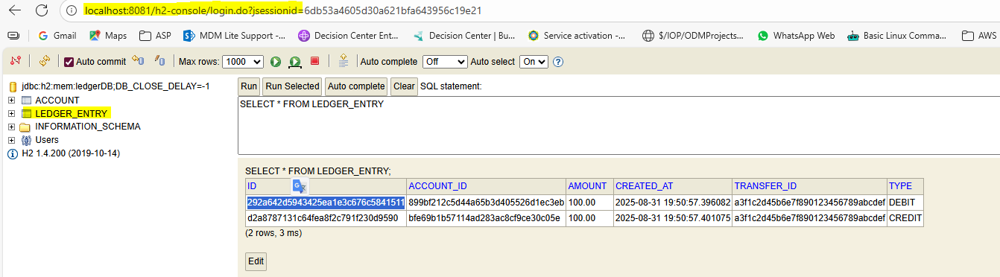
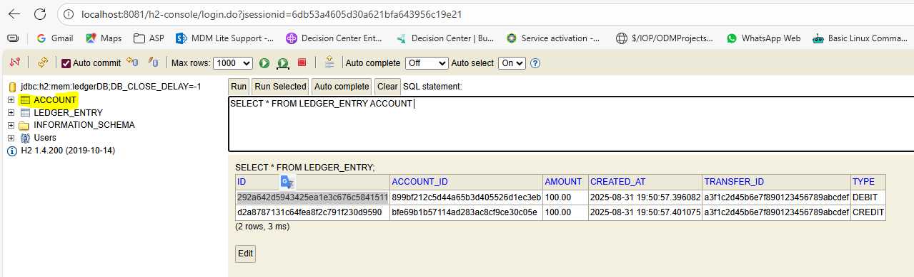
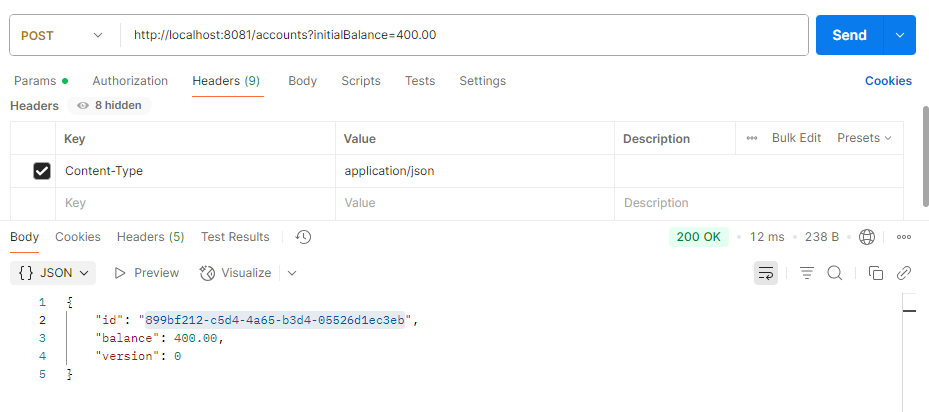
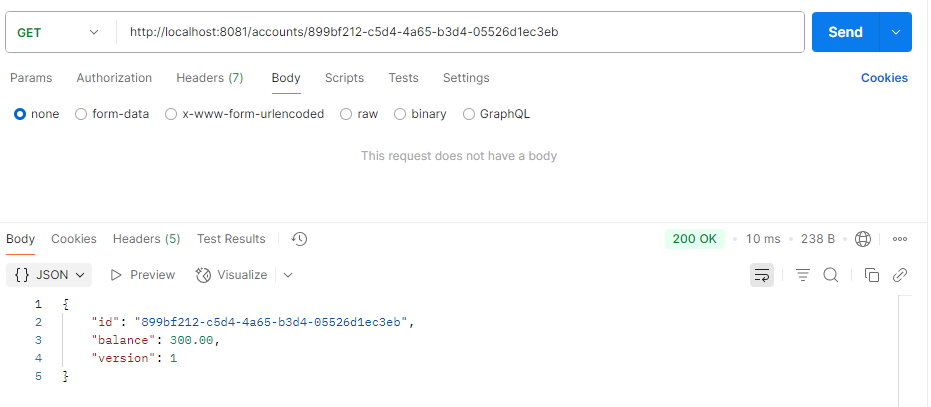
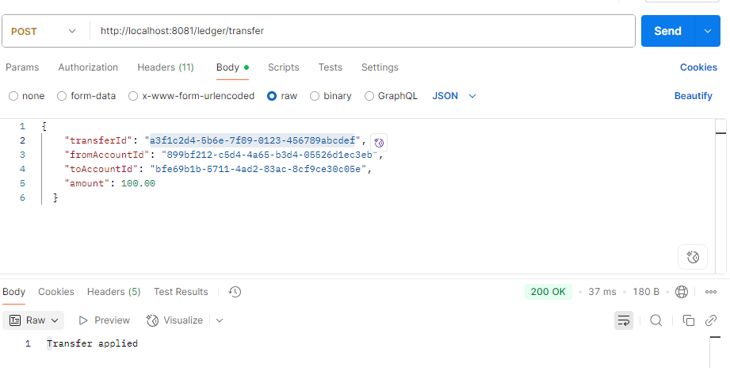

# ledger-service
A Spring Boot microservice that manages account balances and applies atomic debit/credit operations. 
It serves as the financial backbone for transfer orchestration.

# Tech Stack
Java 11

Spring Boot 2.7.18

Spring Data JPA

H2 Database



Maven

#Features

- Create accounts with initial balance
- Apply transfers between accounts
- Validates account existence and sufficient funds
- In-memory H2 database for local development

## Endpoints

### POST `/accounts`
Create a new account.

**Query Param:**
- `initialBalance`


### GET `/accounts/{id}`
Retrieve account details.


### POST `/ledger/transfer`
Apply a transfer.


**Payload:**
```json
{
  "transferId": "UUID",
  "fromAccountId": "UUID",
  "toAccountId": "UUID",
  "amount": 100.00
}
